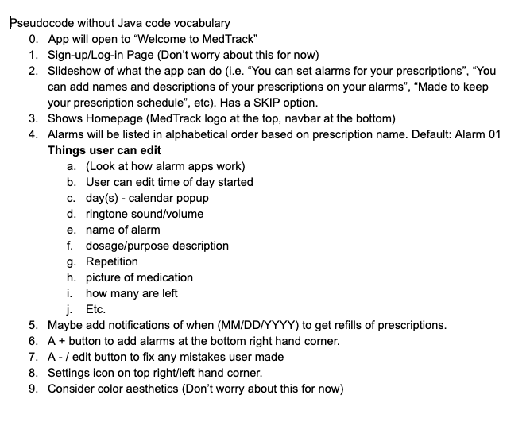
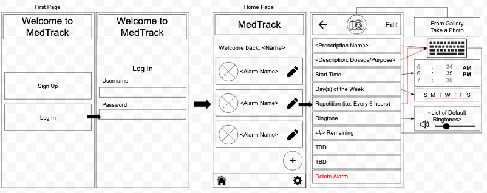

# Entry 3
##### 1/5/2020

## Updates/Progress
A lot has happened since my last blog entry. My group and I downloaded Android Studio into a computer in the classroom and started tinkering with the IDE. As we looked at tutorials and videos, I realized that we were going to have a problem if we are going to use the computer in the classroom. If we were to continue, then we would only be able to work on the app in class. Instead, we decided that we would have to borrow a laptop and download Android Studio on there so that any one of us can bring it home and work on it outside of class. While waiting for our laptop, we look at different tutorials and websites to become more familiar with Android Studio. Youtube videos were especially helpful since we can visually follow along. After about a week and a half, we finally had our laptop and I took it home over the winter break. I was having difficulty setting everything up, so I was only able to download the IDE and create a file for the app during the break.

Due to this delay, we are a little bit behind, but as we were figuring things out in class, I realized that we were making things really hard and confusing for ourselves, and we do not have to have to Firebase. We originally were going to use it because we wanted to be able to have anybody use it and have login information. However, we realized that we might not have enough time to work on both the actual app and the login part of it since we have many plans for the app. We officially stopped working on Firebase, and all our attention is on the app and Java.

After this, we pulled up Android Studio on the laptop, and we were stuck. We had no idea what to start with, so decided that before we start anything with Android Studio, we needed to have an idea of what we wanted the app to look like and how it would work. My group member, Elizabeth, created a folder on Google Drive, and she added a doc for pseudocode, a doc to record what we were doing in class, and a GDrawing to draw what our app would look like. Also, we officially decided that our app would be called “MedTrack”.

Here are the links to our docs and GDrawing and images of what we have so far if you wanted to look our progress
- [Doc of what we do in class](https://docs.google.com/document/d/1_NWBiT3tl-vEboQtRWZ78SQo004R8sNnm5zYsBldmUc/edit?usp=sharing)
- [Doc of pseudocode](https://docs.google.com/document/d/1eGNqHRxrGHHc3pSJTg-j7gcG9AdUIYPGmK2woHI2qKs/edit?usp=sharing)

- [Doc of GDrawing](https://docs.google.com/drawings/d/1IWHLEkYr_6-Mb_Rg4xUp7Q15AoOqxigXbXkgiM7-sBE/edit?usp=sharing)

## Engineering Design Process
Right now, we are on the 4th step of the Engineering Design Process, which is to **plan the most promising solution**, and we are moving on to the 5th step, **creating a prototype**. We really wanted to be on the 5th step already, but solved any of the problems that we were having. We roughly figured out what we wanted MedTrack to look like and how we wanted it to work, with the help of creating pseudocode and drawings. Now, our goal is to finish up making any last decisions and start coding our app.

## Knowledge
During the past few weeks in class, we have been learning about **User-Defined Classes**, which is when users want to input and organize their own information. We could definitely use this in our app, since it is almost all based on the users preferences. The user would be able to input information like the name of the medicine that they are taking, a picture of the medicine, the time(s) that a specific medicine has to be taken, and etc.

## Skills
Throughout all of this, my group and I have definitely have been working on the skills of **problem decomposition** and **organization**.

Breaking our problems down into smaller pieces has helped us figure out what we specifically need to do in order to progress in making our app. We had to look at what was overwhelming us, which was the fact that we wanted to do so many things with our app, and we had to realize that it is not possible to do everything at once.

This then led into us working on our organization. We realized how much we wanted to do, and how we were all trying to just remember all of it. That was not working, so we created a system of recording all the ideas that we thought of using a shared folder on Google Drive.

## Next Steps
Moving forward, my group and I will definitely continue to organize all our ideas and progress, and we will try to always break down our ideas into more manageable steps. More specific to MedTrack, our goal is to connect Android Studio to Github so that it is shareable among our whole group. Later on, we might work on implementing Firebase into our app if we have time.

[Previous](entry02.md) | [Next](entry04.md)

[Home](../README.md)