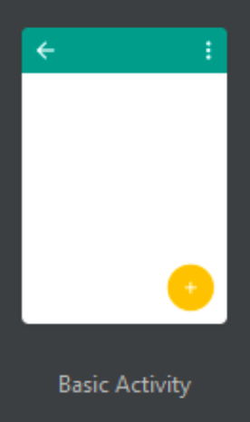
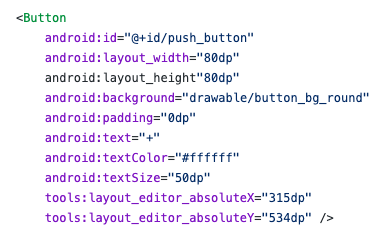
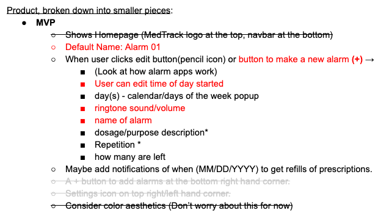
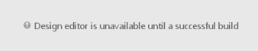
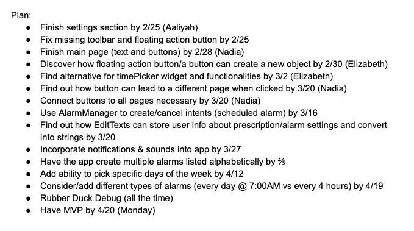

# Entry 5
##### 3/16/2020

## Updates, Progress, and Knowledge
Unfortunately, my group and I have run into a few problems since my last blog entry. After adding our first button, Elizabeth was trying to find out how to add functionality to the button, and while she was doing this, I was working on figuring out what needed to be button and what just needed to be text. During this time, something happened with our IDE and none of us were able to push or pull anything from Github, so we had to delete our current project on Android Studio and create a new one. For this one, we selected a new project template, which had a Floating ActionButton (looked like a plus button) and originally had an envelope image. This did not make sense for our app, so we changed it to have a plus sign, planning to use it for creating new alarms.

There was also a navigation bar on top and a FAB, but both disappeared for no apparent reason. None of us had made any edits or pushed any changes (according to our terminal), which is why it’s a mystery. After our first problem was solved, we realized that the new button that we made disappeared from our IDE and from Github. Luckily, I was able to find that code from my last blog post, and I added that code again to the IDE.

I added and committed the changes I made, but when I tried to push to Github, I couldn’t. The terminal said that I did not have permission to push, so I asked Aaliyah if she added me as a collaborator to the repository since she was the one who made it. She said that she did, but she sent me another invitation. I accepted and I was able to make the push.The toolbar is still missing, but we didn't need it, considering we are working towards an MVP.

Speaking of MVP, our whole APCSA class was “confronted” by our teacher, Mr. Mueller, that we all had great ideas and plans of what we wanted out projects to look and work, but need to consider how much time we have left. Our project is due in about 2 months, and we needed to have a **Minimum Viable Project (MVP)**. Because of this, we were asked to create [an MVP plan](https://docs.google.com/document/d/1oT6_pVsTJQ0GJRSl8vFxRfhs3eHhCAC57CdCikJjv38/edit?usp=sharing), and delete anything that was not necessary. Our other classmates then looked at each other's MVP plans and saw what else had to be removed. This helped us a little bit because there are some things that we definitely didn’t need.

We then faced another problem. Android Studio was not working again. When I opened it up on our shared laptop, It kept giving us a message that said “Loading…” which we thought had been due to the school internet. But soon after, we see the message “Design editor is unavailable until after a successful project sync”

## Engineering Design Process
We are still on the 5th step of the Engineering Design Process, **creating a prototype**, which we still plan on being in for the majority of the time we have left. Other then having a basic knowledge on creating buttons, we are still working on figuring out how to give those buttons functionality, so that the user can successfully use the app for its intended purpose. Me and my group will continue to work on our app, as long as whatever we are working on is critical for an MVP.

## Skills
One skill that we have definitely been working on is **time management**. After being “confronted” by Mr.Mueller, we have been more aware of our deadline and what we could be able to finish to achieve an [MPV](https://docs.google.com/document/d/1oT6_pVsTJQ0GJRSl8vFxRfhs3eHhCAC57CdCikJjv38/edit?usp=sharing) before our deadline. We also have started to schedule when we want certain things done, for example, wanting to create a button before a certain date.

My group has also been working on **embracing failure**. Although we were disappointed in ourselves when our code gave us errors, we reminded ourselves that those errors would teach us what we did wrong and how it differs from what the solution is.

## Next Steps
My group and I are still working on trying to add functionality to our buttons and reminding ourselves of our deadline. Specifically, we want to be able to figure out how to create an alarm, one of the most essential parts of our app.

[Previous](entry04.md) | [Next](entry06.md)

[Home](../README.md)